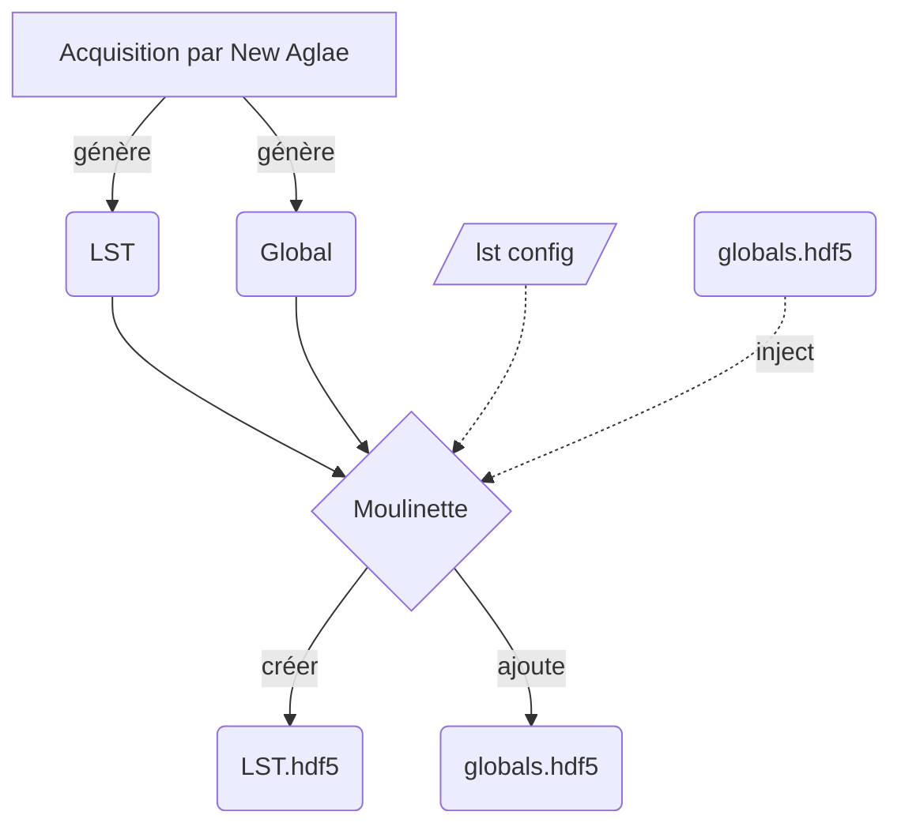
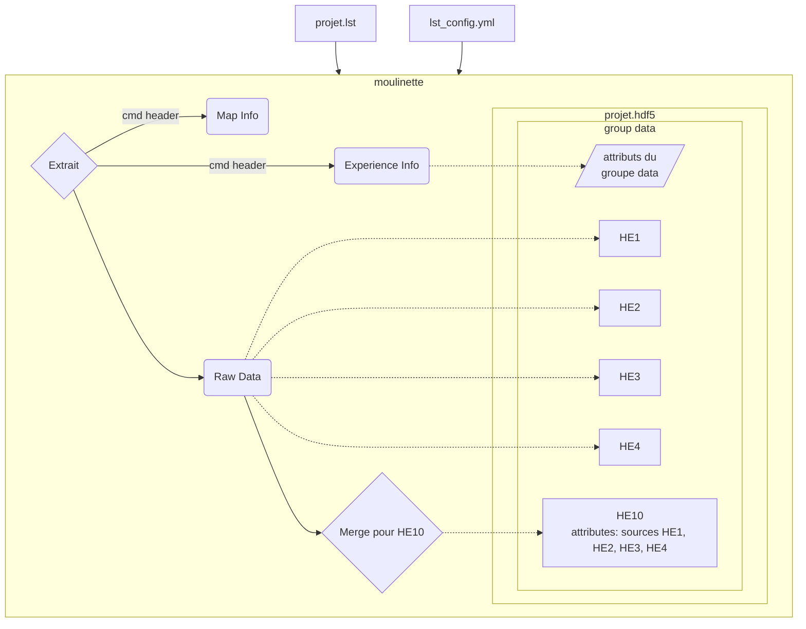
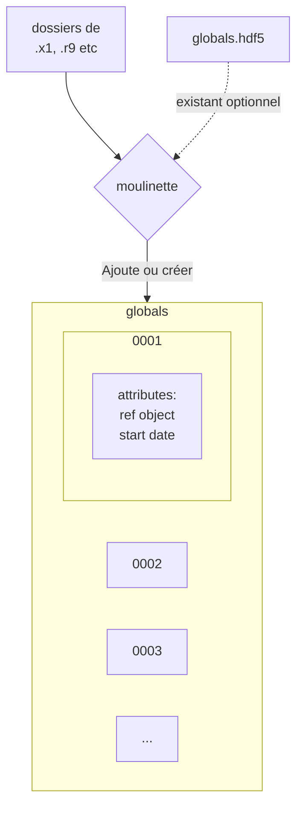

## Overview



## Scénario: LST Seul

Exemple d'un LST avec 4 detecteur HE1, HE2, HE3, HE4, ainsi qu'un detecteur sommet HE10 ayant pour source les 4 detecteurs physique.



Config pour ce formatage:

```yml
# lst_config.yml
x: 256
y: 512
detectors:
  HE1:
    adc: 1
    channels: 2048
  HE2:
    adc: 2
    channels: 2048
  HE3:
    adc: 4
    channels: 2048
  HE4:
    adc: 8
    channels: 2048
  HE10: ["HE1", "HE2", "HE3", "HE4"]
```

### HDF5

LE hdf5 resultant aura la forme suivante:

```
projet.lst
    -- data # group
        attributes:
            beam_energy: 3000keV
            he1_filter: 100umAl
            he2_filter: OFF
            he3_filter: 100umAl
            he4_filter: 100umAl
            le0_filter: 40mmHe
            particle: Proton
        -- HE1 # dataset
        -- HE2
        -- HE3
        -- HE4
        -- HE10
            attributes:
                source: HE1, HE2, HE3, HE4
```

## Scenario: Globals


